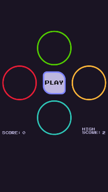
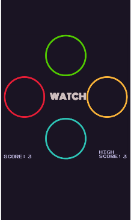
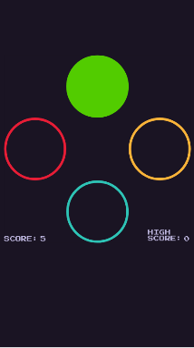

# Simon-game  
Introduced in the late '70's, Simon is an electronic game of memory skill.The computer generates a series of tones and animations that require the user to repeat the sequence. I have adapted this game to be played in a mobile, tablet, or desktop browser. 
---
### Screenshots
  

### Technologies Used:
- HTML
- CSS
- JavaScript

### Getting Started
[Link to Simon](https://jermzblake.github.io/simon-game)  
Press play, watch the computer sequence and then repeat it. Keep playing until you lose. Try and improve your high score!

### Next Steps:
- Add flashier animations to the switches/buttons when they flash
- Add a Modal to start the game
- Speed up the pace once you hit a certain level
- Resolve issue of being able to click  while computer is showing it's sequence
- Add a "your turn" message after computer shows its sequence and it's the players turn to repeat
